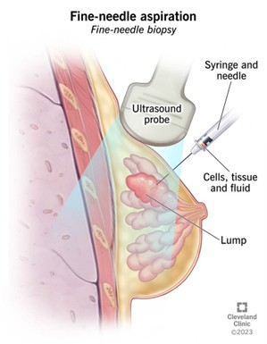

# Breast Cancer SML Project

This project is part of my Statistical Machine Learning coursework.  
It analyzes **breast cancer diagnosis** using features extracted from cell nuclei in fine needle aspiration (FNA) images of breast masses.

The repository contains:
- **`report.html`** – A redacted HTML report where the code chunks show placeholders instead of full implementation; figures and outputs are not included.
- **`script`** – Source code folder with function signatures and structure only; full code available upon request.
- **Dataset description** – See below for feature explanations
- **Languages Used**
  - R
  - HTML

```
For privacy reasons, the full code and results are not included in this public version. Please contact me to request access to the complete project.
````
---

## 📊 Dataset Overview

Fine-needle aspiration (FNA) is a medical procedure healthcare providers use to collect cell samples from a suspicious lump or abnormal area of the body.  
It’s also called a *fine-needle biopsy*.  
FNA involves extracting cells, tissue, and sometimes fluids using a thin needle and syringe.  
The collected sample is then prepared and analyzed — in this case, **microscopic images of the extracted cells are processed to calculate diagnostic features**.



The dataset contains measurements from **fine-needle aspiration (FNA)** images of breast mass cell nuclei.  
It is widely used in machine learning research to develop models that can distinguish between **benign** (non-cancerous) and **malignant** (cancerous) tumors.  

The dataset includes **569 samples**, each described by **30 numeric features** derived from 10 original cell nucleus characteristics.  
These features are designed to capture size, shape, texture, and complexity of the cell nuclei — all of which can be indicators of malignancy.


### Features

1. **Radius** – Average distance between the nucleus center and its perimeter points. Larger radius may indicate malignancy.
2. **Texture** – Standard deviation of gray-scale values. Higher variation can signal irregular texture.
3. **Perimeter** – Total length around the nucleus.
4. **Area** – Total area of the nucleus. Malignant nuclei often have larger areas.
5. **Smoothness** – Local variation in radius lengths. Less smoothness means more irregularity.
6. **Compactness** – `(perimeter² / area) – 1`. Measures how compact the nucleus is.
7. **Concavity** – Severity of concave portions of the contour.
8. **Concave Points** – Number of concave points along the contour.
9. **Symmetry** – How symmetrical the nucleus is. Asymmetry can indicate malignancy.
10. **Fractal Dimension** – Complexity of the nucleus boundary.

For each feature, the dataset includes:
- **Mean** – Average over all measured nuclei in the sample.
- **Standard Error** – Variation across nuclei.
- **Worst (largest)** – Average of the three largest values, emphasizing extremes.

---

## 📂 Project Structure

```markdown

Breast Cancer SML/
├── figures               # Plots and visual outputs
├── report.html            # Analysis report (exported HTML)
├── script.R               # Main R analysis script
├── LICENSE                # License file
└── README.md              # Project overview

```
---

## 🚀 How to Run


#### 1. Clone the repository:

   ```bash
   git clone https://github.com/tezamo/breast-cancer-sml-project.git
   cd breast-cancer-sml-project
   ```


#### 2. Run the analysis:
   ``` bash
  rstudio script.r
   ```

## 📋View the Report

You can see the full rendered report here:  
[Open Report](https://tezamo.github.io/breast-cancer-sml-project/report.html)


## 📜 License
This project is for educational purposes as part of a coursework submission.
Dataset used is from the UCI Machine Learning Repository:  

https://archive.ics.uci.edu/ml/datasets/Breast+Cancer+Wisconsin+(Diagnostic)

---

## 📌 Copyright & Code Usage

© 2025 tezamo. All rights reserved.  

The source code in this repository is provided for educational purposes as part of my coursework.  
You may view and reference the code, but **copying, modifying, or redistributing it in any form without explicit permission is prohibited**.  

If you wish to reuse any part of the code, please contact me to request permission.


[](https://github.com/tezamo/breast-cancer-sml-project/actions/workflows/pages/pages-build-deployment)
[](https://github.com/tezamo/breast-cancer-sml-project/graphs/contributors)
[](https://GitHub.com/tezamo/breast-cancer-sml-project/releases/)
[](https://github.com/tezamo/breast-cancer-sml-project/blob/main/LICENSE)


